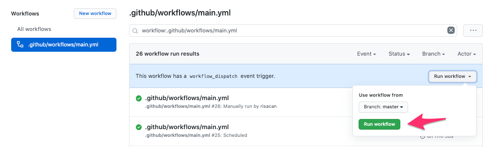

# yancanfm

https://github.com/dots-girls/yancanfm

# Set up

```
$ bundle
$ bundle exec jekyll s
$ open http://localhost:4000
```

# サイトの更新

* Anchor を更新したら、Actions タブのこのボタンを押すよ



## 仕組み

GitHub Actionsのmain.ymlを実行するとAnchorのRSSをもとに自動でエピソードページを新規追加しｍmainブランチにコミットします。
mainブランチへのコミットをトリガーにして`page-build-deployment` が走ります。
